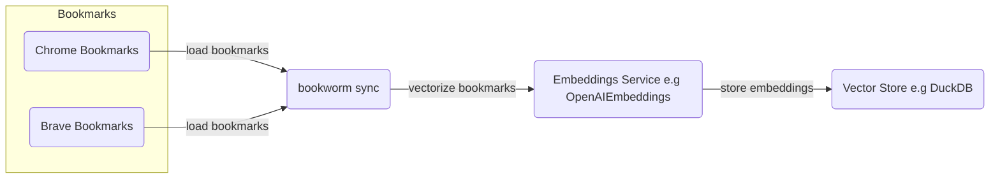
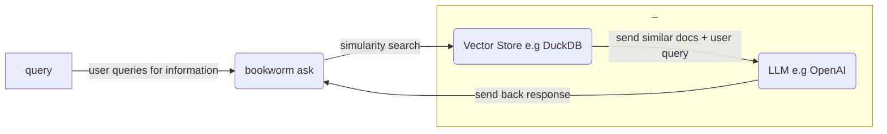

# bookworm

### Processes 

*`bookworm sync`*

```python
python -m bookworm sync
```



---

*`bookworm ask`*

```python
python -m bookworm ask
```



---


### Developer Setup 

```bash
# LLMs
export OPENAI_API_KEY=

# Langchain (optional, but useful for debugging)
export LANGCHAIN_API_KEY=
export LANGCHAIN_TRACING_V2=true
export LANGCHAIN_PROJECT=bookworm

# Misc (optional)
export LOGGING_LEVEL=INFO
```
